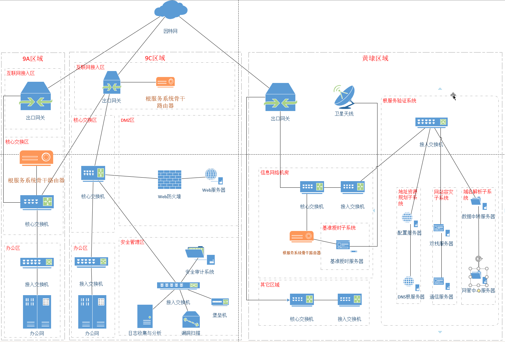

┌──────────────────────────────────────────────────────────────┐
│                      体系治理层                              │
│                                                              │
│  ┌────────────────────────────────────────────────────────┐  │
│  │  网管中心根服务器系统  (NMS-Root)                     │  │
│  │  • 全网统一纳管                                         │  │
│  │  • 策略编排与控制                                       │  │
│  │  • 审计与行为监管                                       │  │
│  └────────────────────────────────────────────────────────┘  │
└──────────────────────────────────────────────────────────────┘
                          │
                          │ 策略/控制/监管
                          ▼
┌──────────────────────────────────────────────────────────────┐
│                      根能力控制层                            │
│                                                              │
│  ┌──────────────────────────┐   ┌──────────────────────────┐ │
│  │ 通信根服务器系统          │   │ DNS根服务器系统           │ │
│  │ (COM-Root)               │   │ (DNS-Root)               │ │
│  │ • 入网控制               │   │ • 域名解析               │ │
│  │ • 地址资源分配           │   │ • 内部域解析             │ │
│  │ • EAS自治域策略          │   │ • 跨域入口解析           │ │
│  │ • 会话授权/密钥分发      │   │ • 条件转发/缓存          │ │
│  └──────────────────────────┘   └──────────────────────────┘ │
│                                                              │
│  ┌────────────────────────────────────────────────────────┐  │
│  │ 配置根服务器系统 (CFG-Root)                           │  │
│  │ • 策略模板管理                                         │  │
│  │ • 配置发布/版本控制                                     │  │
│  └────────────────────────────────────────────────────────┘  │
└──────────────────────────────────────────────────────────────┘
                          │
                          │ 逻辑引导（解析 + 授权 + 策略）
                          ▼
┌──────────────────────────────────────────────────────────────┐
│                      边界与转发层                            │
│                                                              │
│  ┌──────────────────────────┐                                │
│  │ 骨干路由器系统           │                                │
│  │ (BR-Backbone)            │                                │
│  │ • 域内/域间转发           │                                │
│  │ • 策略路由               │                                │
│  └───────────────┬──────────┘                                │
│                  │                                            │
│  ┌───────────────▼──────────┐                                │
│  │ 双栈根服务器系统          │                                │
│  │ (DS-Root)                │                                │
│  │ • 多协议并行能力          │                                │
│  │ • 同域直达判定            │                                │
│  │ • 跨域路径分流            │                                │
│  └───────────────┬──────────┘                                │
│                  │                                            │
│        （仅跨域时启用）                                       │
│                  ▼                                            │
│  ┌──────────────────────────┐                                │
│  │ 中转根服务器系统          │                                │
│  │ (TR-Root)                │                                │
│  │ • 跨域互通                │                                │
│  │ • 协议映射/边界审计        │                                │
│  └──────────────────────────┘                                │
└──────────────────────────────────────────────────────────────┘
                          │
                          │
                          ▼
┌──────────────────────────────────────────────────────────────┐
│                      业务与域内层                            │
│                                                              │
│   同域通信：                                                 │
│     节点A  ───────────────→  节点B                          │
│     （仅经骨干路由，不触发中转根）                           │
│                                                              │
│   跨域通信：                                                 │
│     节点A → 骨干 → 双栈 → 中转 → 外部域                     │
│                                                              │
└──────────────────────────────────────────────────────────────┘

═══════════════════════════════════════════════════════════════
   横向基础能力层（不属于控制上层，而是底座能力）

   授时基准根服务器系统 (T-Root)
   • 为全体系提供统一时间基准
   • 支撑日志可信、审计链闭环
   • 支撑会话有效期与签名验证

═══════════════════════════════════════════════════════════════

系提供统一时间基准
   • 支撑日志可信、审计链闭环

   系提供统一时间基准
   • 支撑日志可信、审计链闭环系提供统一时间基准
   • 支撑日志可信、审计链闭环

   帕拉伊巴国际量子计算中心合作共建项目